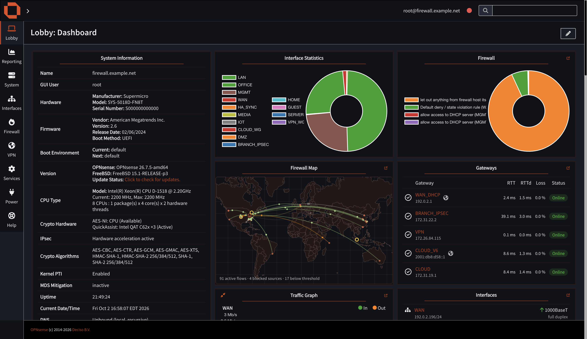
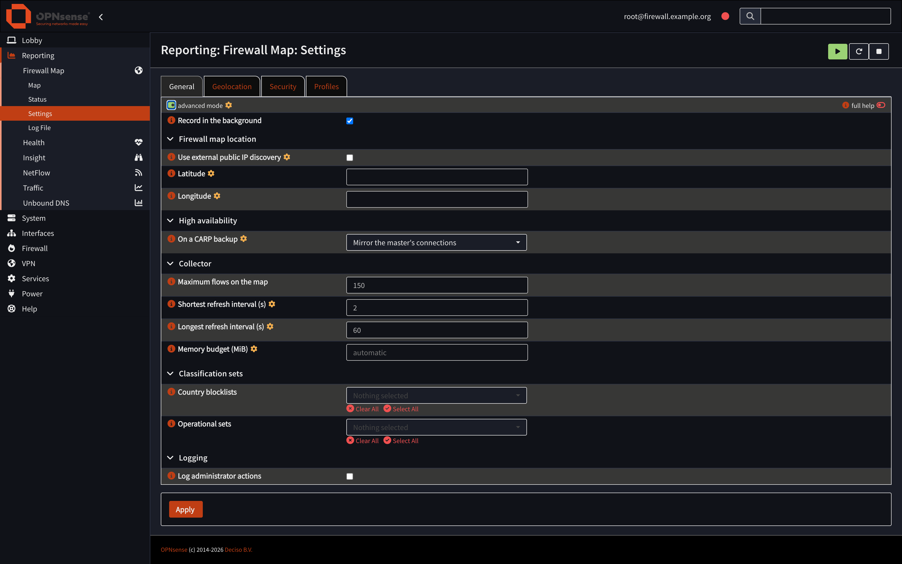
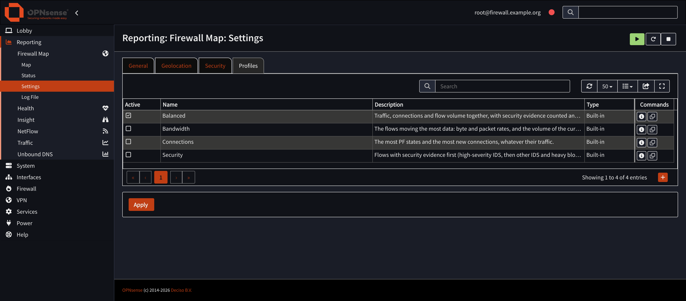
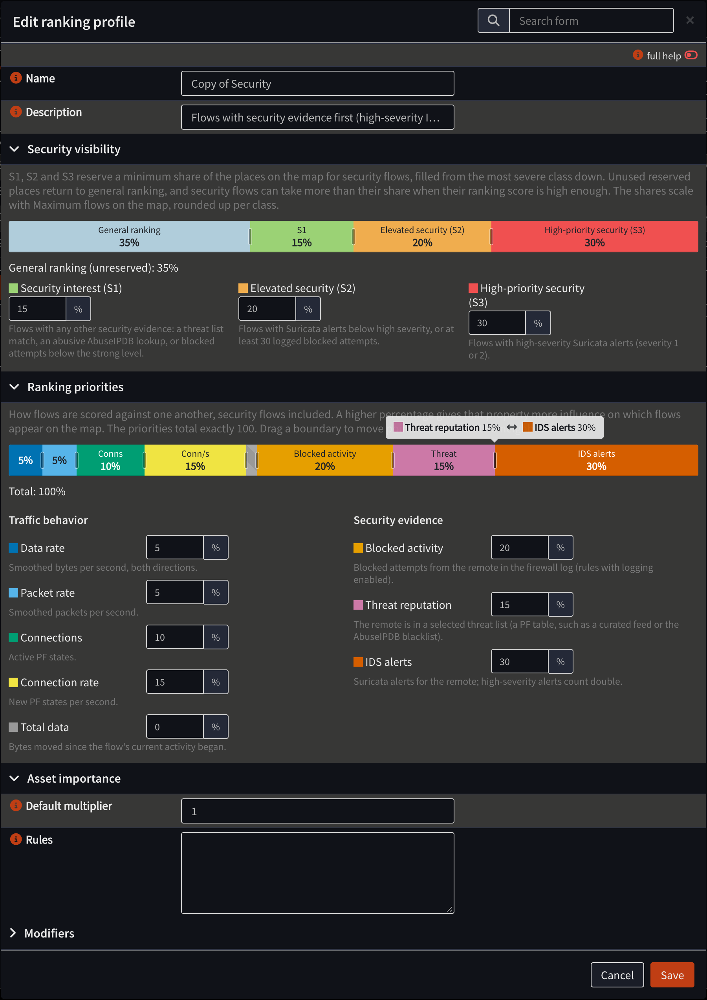

# Dashboard Plus for OPNsense

Dashboard plus for [OPNsense](https://opnsense.org) provides a set of informative widgets to complement/extend the widget set provided by the official OPNsense release.

| Package | What it adds |
|---|---|
| **os-dashboard-plus** | Enhanced dashboard widgets: System Information+, Traffic Graph+, System Metrics+, Thermal Sensors+, Interface Statistics+, Gateways+, Interfaces+, Firewall Logs+, Services+, DNS Health+, QuickAssist+ and CARP+. |
| **os-firewall-map** (Firewall Map+) | The firewall's live traffic (IPv4 and IPv6) on a world map, as a dashboard widget and a full-size page, with plain-language details, threat lists, Suricata alerts and a Threats panel. |
| **os-vnstat-plus** (VNStat Plus) | A configurable VNStat traffic-history dashboard widget, with charts and tables for the interfaces collected by the official `os-vnstat` plugin. |

These widgets are not an official OPNsense plugin or endorsed by OPNsense in any way. I created them for personal use and they fit what I need but they are available for whoever can find a use for them. I am still actively developing so there can be bugs or improvement that can be made. This is a work in progress and I welcome suggestions to make these widgets better or more useful.

Most widgets are read-only visualizations of OPNsense collected data. Services+ additionally uses
the OPNsense service API to start, stop or restart services after an explicit user action. VNStat
Plus requires the official `os-vnstat` plugin, which supplies its collected traffic data.

I have been using them for a while and they are stable on my system. Your mileage may vary depending on your configuration. The only testbed I have is my firewall and they work well there.



*This is a sample dashboard with System Information+, Firewall Map+, Gateways+ and other widgets, on OPNsense's built-in dark theme.*

## Install

This repository provides three installable packages: `os-dashboard-plus`, `os-firewall-map` and
`os-vnstat-plus`. Dashboard Plus and Firewall Map+ can be installed independently. VNStat Plus is
a separate dashboard widget package and depends on the official `os-vnstat` plugin.

As `root` on the OPNsense console or over SSH:

```sh
fetch -qo - https://raw.githubusercontent.com/claudioguareschi/opnsense-dashboard-plus/packages/install.sh | sh
```

This adds the package repository (`/usr/local/etc/pkg/repos/dashboard-plus.conf`) and its public
signing key. 

Then install from **System ▸ Firmware ▸ Plugins** (`os-dashboard-plus`,
`os-firewall-map`, `os-vnstat-plus`), or with `pkg install os-firewall-map`,
`pkg install os-dashboard-plus` and/or `pkg install os-vnstat-plus`. Updates arrive with normal
firmware updates. The repository contains these three packages.

VNStat Plus installs its `os-vnstat` dependency automatically when it is available from the
OPNsense plugin repository. Configure VNStat and choose the interfaces it collects before adding
the **VNStat Traffic+** widget; it shows only interfaces collected by `os-vnstat`.

Firewall Map+ works best with a free MaxMind GeoLite2 key and a free AbuseIPDB key: see
[Firewall Map+](#firewall-map) below for where to get them.

To remove it: uninstall the plugins, then delete `/usr/local/etc/pkg/repos/dashboard-plus.conf`
and `/usr/local/etc/pkg/keys/dashboard-plus-repository.pub`.

## Firewall Map+

The firewall's live traffic on a world map: a dashboard widget, and a full-size page opened with
the expand link on the widget or from **Reporting ▸ Firewall Map ▸ Map** (`/ui/firewallmap`).

> [!IMPORTANT]
> **Get two free keys for the best results.** Firewall Map+ works without them, but it is far more
> useful with both:
>
> - **MaxMind GeoLite2 license key** (free): accurate city-level locations and network (ASN)
>   names. [Sign up for GeoLite2](https://www.maxmind.com/en/geolite2/signup), then create a key
>   under **Manage license keys** in your MaxMind account. If the
>   firewall already has a MaxMind GeoIP alias (**Firewall ▸ Aliases ▸ GeoIP settings**), Firewall
>   Map+ reads the key from there automatically; otherwise enter it in the plugin settings. Without
>   a key the map falls back to the keyless DB-IP Lite databases, which are less precise.
> - **AbuseIPDB API key** (free): the AbuseIPDB blacklist for flagging known-bad addresses, and
>   reputation scores in *Investigate*. [Create an account](https://www.abuseipdb.com/register),
>   then create a key on the **API** page of your AbuseIPDB account and paste it into the plugin
>   settings.
>
> Keys are entered by an administrator in **Reporting ▸ Firewall Map ▸ Settings**. They are
> write-only: never displayed or logged.


*The full-size map draws an arc from the firewall (the house) to every remote
address it is talking to, colored inbound/outbound: green for outbound connections (started inside), orange for
inbound ones (started outside). Red dots are sources the firewall blocked. Other coloring methods are selectable. 
The filters above the map narrow it by traffic type, service, interface, inside host and country; 
**Threats** opens the review list. On the right, **Top talkers** ranks hosts (or countries and networks) 
with a live sparkline, and the details panel below explains whatever you click: here an arc to a 
Microsoft server in Boydton, Virginia, showing the inside host that opened it, the service (HTTPS), 
the remote network, the firewall's decision and rule, transfer totals and rates, with Investigate, 
States and Kill states actions.*


*The dashboard widget: the same live map in compact form, with a one-line summary of active flows
and blocked sources. The link in the corner opens the full-size page; its settings dialog (gear
icon) holds the widget's display options.*

### What you see

- **Live connections**: an arc from the firewall to every remote address, from PF state counters
  sampled every 2 seconds (longer on a busy firewall: the collector asks for it, and the map
  follows). The map shows the flows the active [ranking profile](#how-flows-are-ranked) ranks
  highest, up to *Maximum flows on the map* (150 by default). **Green** arcs were opened from inside your network, **orange** from
  outside (port forwards, services on the firewall), gray from both. Pulses travel in the
  direction the data flows. Arcs fade in and out and keep their curve while they live.
- **Blocked attempts**: connection attempts the firewall dropped (from the filter log) pulse in
  red towards the firewall, above a configurable number of hits.
- **Threats in crimson**: traffic to or from an address in a threat list, the AbuseIPDB blacklist,
  a cached AbuseIPDB verdict of 75% or more, your watchlist, or a Suricata alert of severity 1-2.
- **Suricata alerts**: when the Intrusion Detection service runs, its alerts are read locally and
  shown on the address they concern; addresses that alerted without an open connection get a
  hollow marker.

### Plain-language details

Hover or click an arc or an endpoint. Each card starts with the verdict (*Allowed*, *Allowed:
flagged traffic got through*, or *Blocked*), then one sentence per address, for example:

> *This firewall queried DNS (53/udp) at arin.authdns.ripe.net (RIPE NCC, The Netherlands).*

> *94.154.43.203 (Storm Industries LLC, The Netherlands) reached mail (192.168.1.2) on HTTP (80/tcp) through a port forward.*

> *103.155.198.103 (PT Lintas Jaringan Nusantara, Indonesia) tried SSH (22/tcp) and Telnet (23/tcp) on this firewall: blocked 12× in the last 10 min by "Default deny" on WAN.*

> *⚑ Suricata: ET SCAN Potential SSH Scan (severity 2, Attempted Information Leak), 1× in the last 1 h*

### Full-size page

- **Filters**: traffic (all, allowed, blocked, threats that got through, IDS alerts), service,
  interface, inside host, country and network (click an ASN).
- **Color**: inbound/outbound (default), download/upload, egress interface or service, with a
  legend.
- **Top talkers** by host, country and network with sparklines; click one to filter the map.
- **Resizable panels**: drag the handles between the map and the side panel, and between the top
  talkers and the details (double-click resets).
- **Actions** (administrators): *Investigate* (registry via RDAP, routing via RIPEstat and, with a
  key, AbuseIPDB reputation), Whois, AbuseIPDB page, show or kill the address's states, add it to
  an alias, add its country to a GeoIP alias, and *Mark as threat* (adds it to the
  `FWMAP_Watchlist` host alias).

### Snapshots

A snapshot is a saved map document, not a screenshot. When the collector responds, it captures
up to 5,000 active or fading flows, prioritizing IDS/alerting and threat-listed destinations,
then the strongest traffic. The compact document is limited to 10 MiB; unusually large flow
details can be omitted so smaller entries still fit. Truncation never fails a snapshot: what was
left out is counted, and `capture.required_evidence_complete` says whether every flow with
IDS, alert, blocked-source or threat-list evidence made it in full.

PF detail is collected in a second, on-demand traversal and explicitly associated with each
retained logical flow. The 5,000-state evidence budget is shared by quota: incident flows
(those with IDS, alert, blocked-source or threat-list evidence) are guaranteed 80% of it, each
first getting up to 20 states, and every share a flow cannot use goes back to the others. Within
its quota a flow keeps the states with the most bytes, then the newest. Every flow also records
exact totals over all its matching states (count, bytes and packets in each direction), however
many exemplar rows were kept, together with its quota and the reason for any omission. Quiet PF
flows associated with IDS, alerts, blocked sources or threat intelligence remain eligible
independently of the live top-150 ranking. Raw state rows remain protected by the Show States
privilege.

The detail counts and timestamps describe the second traversal, not an atomic copy of the
first: states may disappear, new matching states may appear, and counters may advance.
Generation, matching/captured/omitted counts, per-flow totals and omission reasons are stored in
`capture.states`. The snapshot list, banner and JSON report captured versus available flows,
geographic omissions and PF-row truncation. **Complete detail** means complete within this
capture scope, not a full PF archive: the existing IDS/log evidence limits still apply. Hosts,
Countries, Networks and Top Talkers describe captured flows, not the entire state table. Older
snapshots remain readable but their completeness is unknown.

1. On the dashboard widget or full-size map, select the camera button. The confirmation toast has
   an **Open in full map** link.
2. On the full-size map, open **Snapshots** to browse saved captures, or use the timeline to move
   between captures from a day. Select one to enter snapshot mode; use **Back to live** to return
   to the current map.
3. In snapshot mode, add or edit a note, download the saved document as JSON, or delete the
   snapshot when it is no longer useful.

Snapshots are retained newest first: up to 50 for 30 days, with a combined 100 MB limit. The
camera is rate-limited to one capture every 10 seconds. If the collector is busy and cannot return
the full capture in time, Firewall Map+ saves the current map summary instead and labels it
**summary only**; that snapshot has no connection-state details.

### Threats

**Threats** on the full-size page lists traffic to or from flagged addresses, sorted into tabs by
what actually happened. **Passed / reached host** (the default) holds what got through: a PF state
shows the firewall allowed it, so this is what to look at. **Blocked by firewall** (from the filter
log) and **Dropped by IPS** (Suricata drops) are kept as evidence without piling up as work.
**All**, **Reviewed** and **Dismissed** complete the set.

Each entry shows every threat list the address is on, who it belongs to and where, what it
reached and from which inside host, services, first and last seen, volume and Suricata
signatures. You can investigate, add a note, mark it reviewed or dismissed, and *Block…* adds the
address (IPv4 or IPv6) to an alias you choose; it blocks only if a firewall rule uses that alias.
When history is full (5,000 entries), blocked and dropped entries are removed before passed ones.
Entries you reviewed, dismissed or annotated are kept apart, up to 1,000. Entries are kept for 90
days, counted from the last sighting (for those, from the last sighting or status change,
whichever is later).

While the widget is on a dashboard, threat history keeps being fed in the background (a light
sample every 20 seconds) even with no map open; switch this off in the Threats footer.

### Threat lists

Threat lists only **mark** traffic; no firewall rule is added or changed unless you use an alias in
a rule yourself. Choose them in **Reporting ▸ Firewall Map ▸ Settings**:

- Curated feeds, downloaded daily by Firewall Map+: Spamhaus DROP, abuse.ch Feodo Tracker,
  Emerging Threats compromised hosts, FireHOL level 1.
- Any URL-table or external alias of your own (e.g. CrowdSec).
- With an AbuseIPDB API key: the AbuseIPDB blacklist (up to 10,000 IPv4 and IPv6 addresses at
  100% confidence, one download a day) and the verdicts of your *Investigate* lookups (flagged at
  75% or more; a separate cache).
- `FWMAP_Watchlist`, filled by *Mark as threat*.

**Maintain blocklist aliases** (in the settings) keeps a `FWMAP_*` alias for each selected curated
feed (a daily URL table) and, with a key, `FWMAP_AbuseIPDB` (filled from the downloaded blacklist,
IPv4 and IPv6, after each download and at boot). Firewall Map+ adds no rules: use the aliases in
your own block rules, on the interfaces you choose. The map itself works from its own daily copy of
each selected feed, so the lists count for flagging with the switch off too. Turning it off, or
deselecting a feed, removes the aliases Firewall Map+ made, but only once no rule uses them; aliases
of your own are never touched. On upgrade the switch starts on where `FWMAP_*` feed aliases
already exist. Uninstalling leaves the aliases in place (rules may still refer to them).

### IPv6

Everything works for IPv4 and IPv6: PF states and the filter log, routed IPv6 prefixes behind the
firewall, threat lists (separate compact IPv4 and IPv6 indexes), AbuseIPDB, GeoIP and ASN lookups,
investigations, the Threats panel and *Block…*. An address with a port reads `[2001:db8::1]:443`.

### Suricata (Intrusion Detection)

No setup is needed in Firewall Map+: alerts from `/var/log/suricata/eve.json` appear as soon as
Suricata raises them. Suricata only matches most rules when one side is in its *Home networks*.
When it monitors the WAN interface it sees addresses before NAT, so add your WAN address(es) to
*Home networks* (Services ▸ Intrusion Detection ▸ Administration), or monitor the LAN interfaces
instead.

### Settings

The plugin settings are in **Reporting ▸ Firewall Map ▸ Settings** (administrators), in four
tabs; press **Apply** after saving. When *Maximum flows on the map* or the active profile changes,
Apply restarts the collector and open maps wait for its first ranked sample.



*The General tab with OPNsense's advanced mode on; the settings marked with a gear are hidden
until it is switched on.*

- **General**
  - *Record in the background* keeps recording threats while no map is open, as long as the
    widget is on a dashboard.
  - *Maximum flows on the map* (Collector, 25 to 1000, default 150): how many flows the collector
    ranks and sends to the map each sample. More flows take more processing time and memory (at
    1000 flows and a 2-second refresh, each open map receives 1 to 2 MB of JSON a refresh); it
    never limits firewall states or connections.
  - *Country blocklists* (OPNsense GeoIP aliases) and *Operational sets* (PF tables with a meaning
    of your own: partners, cloud providers...) name the sets a remote belongs to on the map.
    Selecting one blocks nothing and never marks traffic as a threat.
  - *Log administrator actions* (see Log File below).
  - With **advanced mode** on: *Firewall map location* (where the firewall sits on the map:
    normally its public WAN address, geolocated with the configured database; *Use external
    public IP discovery* for a WAN behind upstream NAT, which finds the public address with
    api.ipify.org and geolocates it the same way; or manual latitude and longitude, which win;
    and *IPv6 location*: IPv6 joins the IPv4 location when any precise IPv6 location of the
    firewall, its inside prefixes first, is within 50 km of it or within the two locations'
    accuracy. A location known only by country never counts, and tunnel and VPN interfaces are
    never used. *Automatic* shows a second house only for IPv6 precisely located elsewhere;
    *Same as IPv4* always shows one. The Status page names the address each house comes from),
    *High availability* (*On a CARP backup*: mirror the master's connections, or show only this
    firewall's traffic) and the collector's tuning: *Shortest* and *Longest refresh interval*
    (2 to 300 seconds; on a busy firewall the collector asks for a longer one, within these
    bounds, and the map follows) and *Memory budget* (empty: 5% of physical memory, at most
    1024 MiB). The memory budget bounds the state collector and sets the largest PF state table
    the map processes; above it the map says the state table is too large instead of slowing the
    firewall.
- **Geolocation**: the geolocation service (automatic, MaxMind GeoLite2, MaxMind GeoIP2 City,
  DB-IP Lite), the MaxMind license key (taken from a MaxMind GeoIP alias when present) and how
  often the database is updated.
- **Security**: threat lists, the AbuseIPDB API key and *Maintain blocklist aliases*.
- **Profiles**: the ranking profiles, below.

Keys are write-only and never displayed or logged: leave a key field empty to keep the stored key,
or tick *Remove the stored key* to delete it.

### How flows are ranked

A busy firewall holds far more connections than a map can show. Each sample, the collector scores
every flow with the active ranking profile and sends the best ones, up to *Maximum flows on the
map*:

1. **Score.** The profile's *ranking priorities* weigh eight properties of a flow, each a
   percentage, together 100:

   | Priority | What it measures |
   |---|---|
   | Data rate | Smoothed bytes per second, both directions |
   | Packet rate | Smoothed packets per second |
   | Connections | Active PF states |
   | Connection rate | New PF states per second |
   | Total data | Bytes moved since the flow's current activity began |
   | Blocked activity | Blocked attempts from the remote in the firewall log (rules with logging) |
   | Threat reputation | The remote is in a selected threat list (such as a curated feed or the AbuseIPDB blacklist) |
   | IDS alerts | Suricata alerts for the remote; high-severity alerts count double |

   *Asset importance* then multiplies the score of flows from chosen local hosts or networks (1
   to 100; a flow takes its local host's longest matching rule). Flows that never moved data are
   left out, handshake-only probes count once they reach 10 attempts, and a flow already on the
   map keeps a slight edge so the map does not flicker.
2. **Security visibility.** A flow with security evidence belongs to one class: **S3**
   high-severity Suricata alerts (severity 1 or 2); **S2** other Suricata alerts, or at least 30
   logged blocked attempts; **S1** any other evidence (a threat list match, an abusive AbuseIPDB
   lookup, fewer blocked attempts). The profile reserves a minimum share of the map's places for
   each class, rounded up (30% of 150 is 45 places). S3's best-scoring flows fill its reserved
   places first, then S2's, then S1's.
3. **Everything else by score.** The remaining places go to the best-scoring flows overall,
   security flows included, so a class can take more than its share. Places a class does not use
   go to general ranking.

The map never shows more than *Maximum flows on the map*, and the browser draws every flow it is
sent.

### Ranking profiles

Exactly one profile is active, chosen in the **Profiles** tab's *Active* column (it takes effect on
**Apply**). Four are built in:

- **Balanced** (the default): traffic, connections and flow volume together, with security
  evidence counted and a few places kept for flows that carry it.
- **Bandwidth**: the flows moving the most data.
- **Connections**: the most PF states and the most new connections, whatever their traffic.
- **Security**: flows with security evidence first, then connection activity.



*Built-in profiles are shown read only (ⓘ) and cloned to make your own; **+** adds a profile
starting from Balanced. Your profiles can be edited, cloned and deleted (except the active one).*



*The profile editor. **Security visibility** splits the map's places: General ranking and the
minimum reserved shares of S1, S2 and S3. **Ranking priorities** shows how much each property
counts. Drag a splitter to move percentage points between its two neighbours only (hovering names
them; the arrow keys move 1 point, Shift 5), so a bar always totals 100, or type exact values:
the editor shows what is left or over and keeps Save disabled until the split is valid. Values
are whole percentages; a 0% property keeps a narrow striped slot. Asset importance takes one rule
per line (`192.168.1.25 10`, `192.168.10.0/24 3`).*

**Reporting ▸ Firewall Map ▸ Status** shows the installed Firewall Map version, whether the collector
is running (with the usual start, stop and restart controls), how fresh the geolocation database, the
threat feeds and the AbuseIPDB blacklist are, and any download errors. Each has an *Update now* button.
Its *State collector* section shows the state collector (`/usr/local/libexec/firewallmap-collector`):
whether it is running, its collector protocol and the expected one (1), its process, restarts and the
PF state ABI it was built for, the state limit its memory budget allows, the cost of the last sample,
the flows on the map (the last sample's ranked flows of the maximum), whether the classification
snapshot is current (a failed refresh keeps the previous PF tables, marked stale, with the reason),
anything left out (unsupported states, candidates or threat remotes over their budgets) and the last
refusal or error. A collector that speaks another protocol means the package's components come from
different versions: the status says *Incompatible* and the fix is to reinstall or upgrade the
Firewall Map package. An administrator can check the collector against the running kernel with
`configctl firewallmap collector selftest`.

**Reporting ▸ Firewall Map ▸ Log File** is the plugin's log (System ▸ Settings ▸ Logging sets how long
it is kept and can forward it). It records what helps diagnose a problem, without one line per
sample: the collector starting and stopping (and why), a map being opened or closed, each download
of the geolocation database, the threat feeds and the AbuseIPDB blacklist with its result, settings
being applied (with the blocklist aliases created or removed), and errors, each logged once with
its recovery. Keys are never logged. Please include this log when asking for help. With *Log
administrator actions* on (off by default), it also records who investigated an address, changed
or deleted threat entries, and saved, annotated or deleted snapshots.

Each widget's display options are in its own settings dialog (gear icon on the widget): busiest-arc
highlighting, city labels, blocked traffic and its minimum hits, hostname lookups and network (ASN)
names. The map draws every flow the collector sends (see *Maximum flows on the map*).

### What leaves the firewall

| When | Where | What is sent |
|---|---|---|
| Geolocation database update (every few days) | MaxMind or DB-IP | Your MaxMind key (MaxMind only). Lookups themselves are local. |
| Daily, with an AbuseIPDB key | AbuseIPDB | Your key, to download the blacklist. |
| Threat-list aliases (daily, OPNsense's alias updater) | The list provider | The download request only. |
| *Investigate* clicked | rdap.org, stat.ripe.net, AbuseIPDB | The one address being investigated. |
| *Look up hostnames* enabled | Your DNS resolver | Reverse lookups of remote and unnamed inside addresses. |
| *Use external public IP discovery* on, and the WAN has only a private address (at most every 15 minutes until it answers, then once a day) | api.ipify.org | A plain HTTPS request; the reply is the firewall's public IPv4 address, geolocated locally. |

The collector runs while a map is open, or in the background while the widget is on a dashboard
and background recording is on. It uses a few percent of one CPU core while a map is open.

## Dashboard Plus

Twelve widgets that sit next to OPNsense's built-in ones in **Add widget**. Everything is read
locally from the firewall's own API. Each widget's options are in its settings dialog (gear icon
on the widget).

**Access.** The *Dashboard: Dashboard Plus widgets* privilege covers only the plugin's own system
details. The data a widget shows from OPNsense itself stays under OPNsense's own privileges, as for
OPNsense's own widgets: a user sees a widget only with the privileges for everything it reads (for
example Firewall Logs+ needs *Diagnostics: Logs: Firewall: Live View*). Interfaces+ has its own
privilege, *Dashboard: Interfaces+ status*, like *Services+ control*, *DNS Health+ status* and
*Dashboard: CARP+ status*.
Administrators see every widget. Upgrading from 0.50: a user who had only the Dashboard Plus privilege also needs those
OPNsense privileges for the widgets that show firewall, gateway or interface data.

Since some of these widgets are meant to extend the information provided by the existing OPNsense widgets, so their name may collide with the existing ones. For this reason the widgets in this package are marked with a **+** trailing sign in the **Add widget** selection box. This does not imply these widget are better then the OPNsense, they are just a little different and to me a little bit more familiar as I am coming from pfSense (**and very happy to ditch it!**). 

### System Information+


*Name and GUI user; hardware (manufacturer, model, serial number); firmware (vendor, version,
release date, boot method) and the current and next boot environment; on ZFS, each pool's layout
(single disk, stripe, mirror, RAID-Z1/2/3, dRAID), health, device errors or data loss, capacity and
last scrub (orange when it is older than 35 days or never ran); OPNsense and FreeBSD
versions with update status; CPU model, current and maximum frequency and core/thread layout;
crypto hardware (AES-NI, QuickAssist) and the algorithms accelerated for IPsec; kernel PTI and MDS
mitigation state; uptime, date and time; and the DNS resolver the firewall itself uses.
Settings: which sections to show.* While the dashboard is in edit mode, sections can be dragged
into any order.

### System Metrics+


*CPU usage and temperature as live charts, with the load averages; gauges for memory, firewall
states (**Show** opens the state table), mbufs and swap, with the exact figures under each gauge;
and filesystem usage. Settings: which components to show, and the chart window (20 seconds,
1 minute or 5 minutes). Its readings, shared with Thermal Sensors+ and System Information+, come
from a small shell script (one `sysctl` call and `pfctl` twice; mbufs, swap and filesystems once
a minute) that configd hands to every open dashboard for five seconds.*

### Traffic Graph+


*Live traffic in and out, one chart per interface or all interfaces combined, each interface in its
own color. The icon in the top-left corner switches between the expanded view shown here and a
compact one. Settings: per-interface or combined display, which interfaces, and the time window
(20 seconds, 1 minute or 5 minutes).* Rows can be dragged into any order.

### Gateways+


*Every gateway with its address, RTT, RTT deviation, packet loss and a status badge (online,
warning, offline, unmonitored); the globe marks the default gateway. Rows can be dragged into any
order. Settings: which gateways and which metrics to show.*

### Interfaces+


*For the interfaces you choose: the name with its IPv4 and IPv6 addresses, then the media and duplex
(or the tunnel type for IPsec VTI, WireGuard and OpenVPN), the MAC address and an Online, Offline or
No carrier pill in the theme's colors; rows can be dragged into any order. Settings: which interfaces and the refresh interval (10, 30 or 60 seconds).
A refresh reads `ifconfig -L` once (about 80 ms of CPU) instead of OPNsense's interfaces overview,
which also reads every SFP module and costs about ten times as much; the addresses are still
chosen by OPNsense's own functions.*

### Interface Statistics+


*A table showing Bytes, packets, errors and collisions in and out per interface; rows can be dragged into any
order. Settings: which interfaces, which fields, and the refresh interval (5, 10 or 30 seconds).*

### Thermal Sensors+


*The temperature sensors you choose, including per-core readings, as bars with the current value.
Settings: which sensors.*

### Firewall Logs+


*The live firewall log: action, time, source and destination with ports, the interface and the
rule that matched (click it to open the full firewall log filtered on that entry). Settings: which actions (pass, block or all), which
interfaces, and how many rows.*

### Services+

*A searchable and filterable service table with running, stopped and locked states. Services can
be selected in the widget settings, and start, stop and restart actions require confirmation.*

### DNS Health+

*A compact resolver health view showing Unbound status, recursive or forwarding mode, query rate,
cache hit rate and DNSBL totals. When Unbound has forwarding entries, the configured AdGuard
upstreams are listed by name and address. Settings: refresh interval. The live query rate reads
only Unbound's query counter every two seconds (`unbound-control stats_noreset`, which never resets
the counters OPNsense reads), not the full statistics.*

### QuickAssist+

*A read-only live view of Intel QuickAssist devices: a Chart.js activity graph for completed
firmware requests, request/response pipeline lag and outstanding work, plus a Device
Capabilities panel with device and acceleration-engine counts, configured services, OpenCrypto
Framework state and supported kernel cryptographic algorithms. Clock information is shown only
when the running QAT driver exposes it. It discovers the loaded QAT driver dynamically and shows
unavailable or degraded states without changing driver, OCF or firewall configuration. Each
two-second sample is one read of the QAT sysctl tree, parsed by the web server, with no script
started.*

### CARP+

*High availability at a glance. The header gives this firewall's role over all its CARP virtual
IPs in one pill (Master, Backup, Initializing, or Split when it is master for some and backup for
others, the classic fault), with preempt, the advertising skew and the demotion counter. Below it:
whether the peer is heard (advertisements per second from the master, or sent by this master; red
when they stop), state sync over pfsync (sync interface and peer, bulk sync, state updates per
second in and out, real errors only), where the configuration is synchronized to, and the last
CARP change from the system log with up to eight more on request. The VIPs fold into one line
while they all agree and open as a table (interface, VHID, description, addresses, state) when
they do not. Every ten seconds it reads `ifconfig -L`, the CARP sysctls, `pfsync0` and the CARP and
pfsync counters once, in one small shell script parsed by the web server; it changes nothing.
The title opens OPNsense's CARP status page.*

## VNStat Plus

**VNStat Traffic+** is a separate dashboard widget package for traffic history. It requires the
official `os-vnstat` plugin and uses the interfaces selected there; `os-vnstat-plus` does not
collect traffic on its own. Select an interface and hourly, daily, monthly or yearly history, then
use the chart and table to compare download, upload and total traffic. Settings choose the visible
sections, chart window and refresh interval.

The screenshots come from a live firewall; host names, addresses, interface names and location
were replaced with example values.

## Building from source

On an OPNsense machine of the target release (git is required):

```sh
git clone https://github.com/claudioguareschi/opnsense-dashboard-plus.git
cd opnsense-dashboard-plus
tools/build.sh                   # both plugins; packages in ./dist
DEVEL=1 tools/build.sh security/firewall-map   # a development package
pkg add -f dist/os-firewall-map-devel-*.pkg
```

The build and publishing scripts live in `tools/`; packages are built only from the plugin
folders, so `tools/` is never part of a package. `build.sh` fetches the [opnsense/plugins](https://github.com/opnsense/plugins) build framework
for the running release and builds each plugin in it unchanged, so the plugin folders can also be
copied into a fork of opnsense/plugins as they are.

`build.sh` is the only step needed for either package. The Dashboard Plus widgets are plain
JavaScript and ship as written. Firewall Map+'s map renderer is the one part with its own build:
its sources in `security/firewall-map/renderer` are bundled with Vite into
`firewall-map-renderer.js` (with `firewall-map-renderer.LICENSE`, the licenses of the bundled
deck.gl and luma.gl libraries) and `firewall-map-page.js` in `src/opnsense/www/js/`. Those built
files are committed, so rebuild them only after changing the renderer sources:

```sh
tools/build-renderer.sh           # npm ci with the pinned versions, build, test, copy into src/
tools/build-renderer.sh --check   # rebuild and confirm the committed files are identical
```

It needs Node.js 20 or newer. The build also makes `firewall-map-diagnostics.js`, a diagnostics
panel (add `?debug=1` to the map's address). It is kept in `security/firewall-map/devel/`, outside
`src/`, so no package includes it; only development builds (`DEVEL=1 tools/build.sh`) add it.

Firewall Map+'s tests run from `security/firewall-map` (the renderer's run with the build above).
The Python suite compiles the collector with a synthetic PF reader, so it needs a C compiler; the
PHP command line, when installed, also checks the models and controllers against the scripts:

```sh
cd security/firewall-map && python3 -m unittest discover -s tests
FM_COLLECTOR_TEST_CC=clang FM_COLLECTOR_TEST_FLAGS="-g -fsanitize=address,undefined" python3 -m unittest discover -s tests
```

### Publishing (maintainer)

Releases share one version (`PLUGIN_VERSION` in each Makefile, no revision) and are published
together: 0.50, 0.51, ... Between releases a package under development carries test builds
numbered after the last release (Firewall Map+ 0.59.12, 0.59.13, ...), which are never tagged or
published; at the next release every Makefile moves to the new version together (0.60).
The signed feed lives in the `packages` branch, kept as a single commit. On the machine holding
the signing key:

```sh
tools/build.sh
tools/publish.sh /path/to/packages-branch-checkout
```

then commit and push that checkout, and tag the release commit on `main` as `v<version>`.
Every package of the feed must be in the folder when it is signed; `publish.sh` replaces older
versions and signs the whole catalog.

## Changelog

- **0.61** (all packages): two Firewall Map+ IPv6 fixes. Investigating an IPv6 address on the
  map page works again (it was refused as "not an IP address"). A dual-stack firewall is shown at
  one place: IPv6 follows the IPv4 location unless it is precisely located elsewhere (new *IPv6
  location* setting), so a WAN IPv6 address that the database knows only by country no longer
  adds a second house. Dashboard Plus and VNStat Traffic+ are unchanged apart from the version.
- **0.60** Firewall Map+ gets the collector audit remediation (bounded classification refresh,
  stricter request parsing, accounted response buffer, fuzzed decoder), adaptive refresh in the
  map and widget, a tabbed settings page with OPNsense's advanced mode, Country blocklists from
  GeoIP aliases, *Maximum flows on the map* (the collector's `--flows`, 25 to 1000) and the
  graphical ranking profile editor (read-only built-ins, new profiles with **+**).
  VNStat Traffic+ takes its select and table colors from the theme and its chart spans the full
  width; QuickAssist+'s live chart scrolls like Traffic's.
- **0.59** (all packages): Firewall Map+ keeps complete shared incident snapshots while disclosing
  captured PF connection states only to users with OPNsense's native Diagnostics: Show States privilege.
- **0.58** (all packages): refines Dashboard Plus QuickAssist+ with a Chart.js activity graph,
  stable shared-sample rates, device-capability tiles that adapt when clock information is absent,
  and QAT capability and kernel cryptographic-algorithm details.
- **0.57** (all packages): Dashboard Plus adds QuickAssist+, a read-only live monitor for Intel
  QAT devices. Firewall Map+ resolves unnamed inside hosts through the existing hostname-lookup
  option when DHCP is external; DHCP names remain authoritative and private PTR results expire
  quickly after an address reassignment.
- **0.56** (all packages): documents Firewall Map+ snapshots and the three published packages.
  Adds browser-level coverage for DNS Health+, Services+ and VNStat Traffic+ behavior.
- **0.55** (all packages): Dashboard Plus adds DNS Health+, live DNS request-rate and Services+.
  Firewall Map+ adds camera snapshots, a snapshot timeline and saved-state review; it also
  recognizes primary-WAN double NAT while keeping state identities local, with optional manual or
  discovered map anchoring. VNStat Plus is published for the first time and requires the official
  `os-vnstat` plugin.
- **0.53** (both packages): less CPU while a dashboard is open.
  - Firewall Map+: each collector sample costs about a third of the CPU it did, and the Status
    page shows how long the last sample took. Map polls are answered by a small shell script
    instead of starting Python every 2 seconds.
  - System Metrics+, Thermal Sensors+ and System Information+ share one request per refresh
    instead of System Metrics+ alone making seven; slow-changing numbers (mbufs, swap, disks) are
    read once a minute. The Dashboard Plus privilege now covers these numbers.
  - Interfaces+ can refresh every 10 (default), 30 or 60 seconds, Gateways+ loads its gateway
    list once and then only the status, and Interface Statistics+ refreshes every 5 (default), 10
    or 30 seconds (a saved 1 second becomes 5).
  - Dashboard Plus widgets pause while their browser tab is hidden and refresh when it shows again.
- **0.52** (both packages):
  - Users with only the map privilege now get live data (before, only administrators did).
  - The map walks at most as many states as 5% of RAM allows, at about 6 KB per state: about
    35,000 on a 4 GB firewall instead of about 100,000. Above that it says so instead of mapping.
  - Apply on the settings page calls `service/reconfigure`; `settings/reconfigure` is gone.
  - The map page offers only the actions the user may use.
  - The diagnostics panel ships only in development builds.
  - Reviewed, dismissed and annotated threat entries survive pruning (up to 1,000).
  - A stuck geolocation download restarts on its own; "Update now" right after a download is
    skipped.
  - A damaged geolocation file, a half-written settings file or an oversized feed no longer
    trips up the collector.
  - Translated text on the map, Status and Settings pages is shown as written (no `&#039;`).
- **0.51** (both packages):
  - Firewall Map+ settings move to **Reporting ▸ Firewall Map ▸ Settings**, next to **Map**,
    **Status** (collector, geolocation database, feeds, with *Update now*) and **Log File** (its own
    log). The widget's gear keeps only display options. Stored keys can be removed.
  - Firewall Map+ reads its own settings file instead of `config.xml`, and no longer needs
    libmaxminddb.
  - System Information+: choose which sections show in the widget settings and drag them into any
    order in edit mode.
  - Dashboard Plus follows the theme colors and uses Font Awesome 6; its privilege now covers only
    its own two endpoints.
- **0.50** (both packages): first public beta. Dashboard Plus and Firewall Map+ share one version
  number and are released together.

## License

BSD 2-Clause, see [LICENSE](LICENSE). Firewall Map+ bundles deck.gl and luma.gl (MIT) and Natural
Earth data (public domain); DB-IP Lite data is CC BY 4.0; MaxMind GeoLite2 is subject to MaxMind's
EULA. See [THIRD_PARTY_NOTICES](security/firewall-map/THIRD_PARTY_NOTICES).
