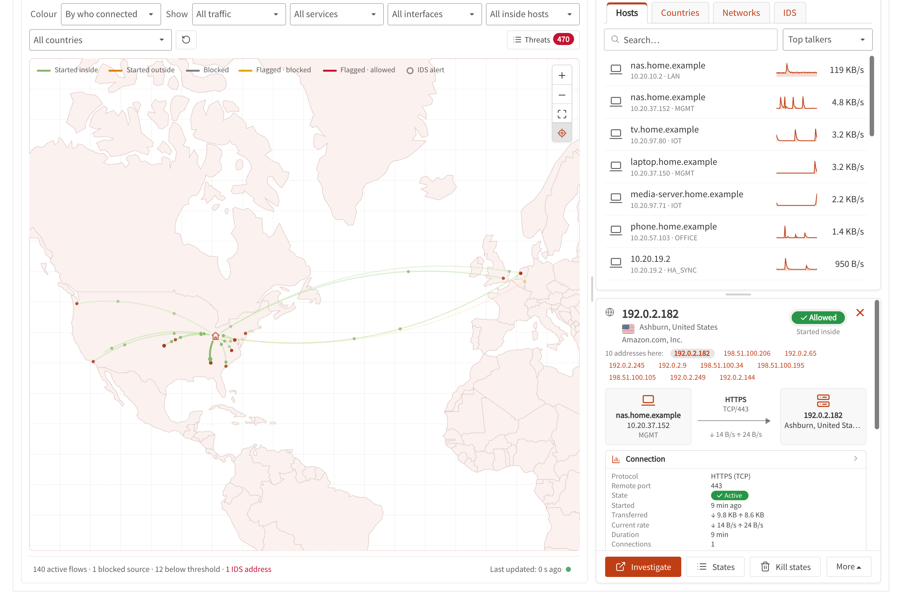
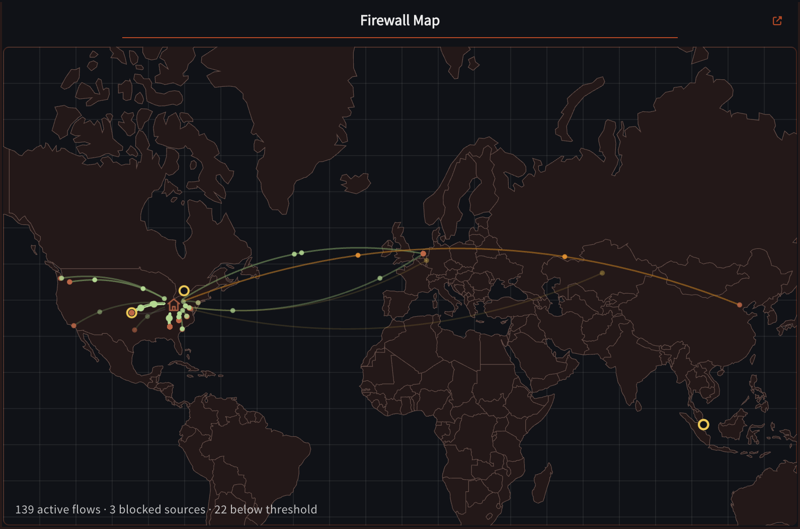
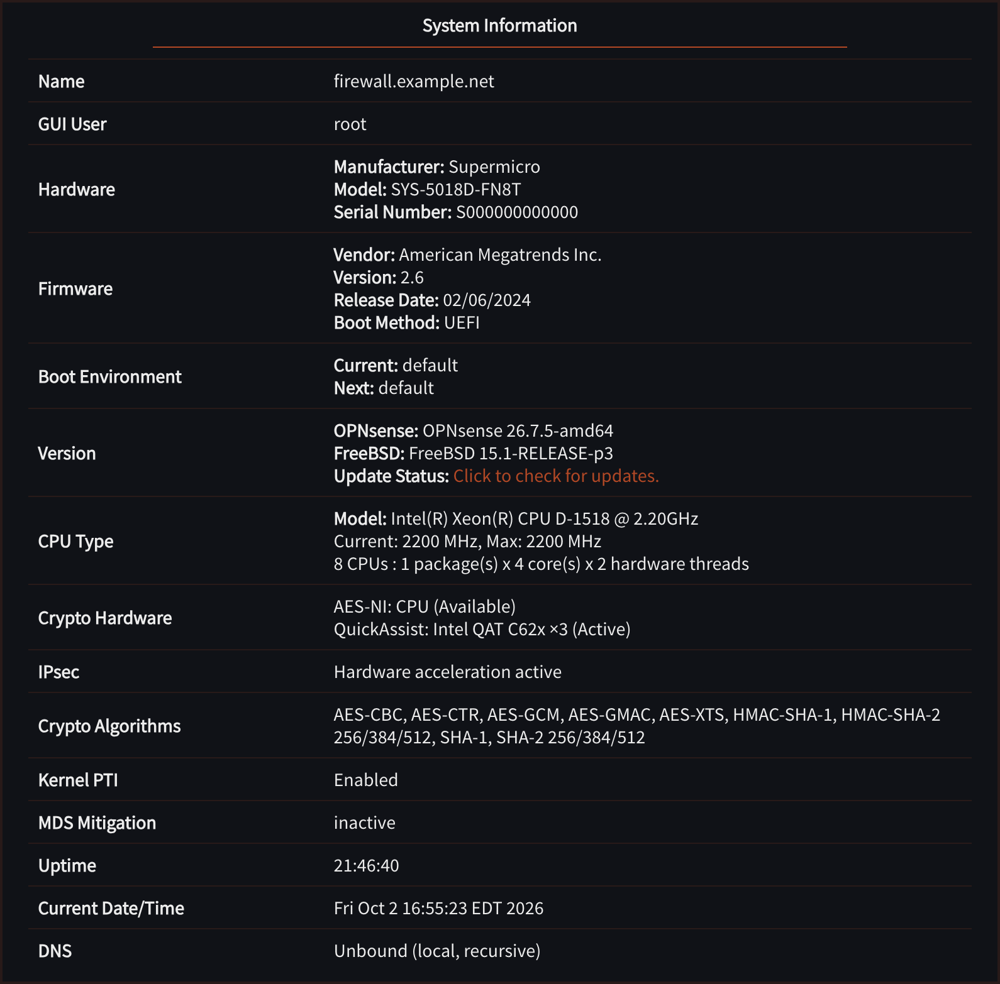
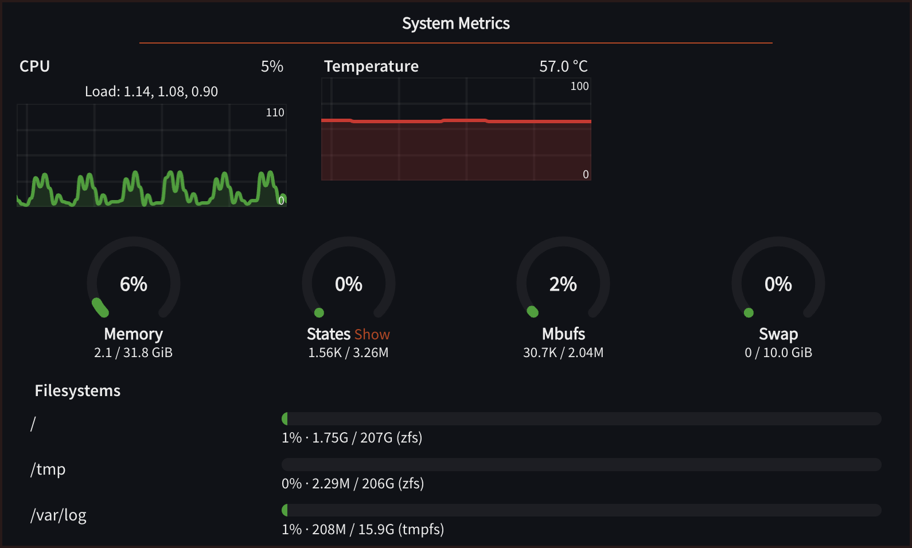
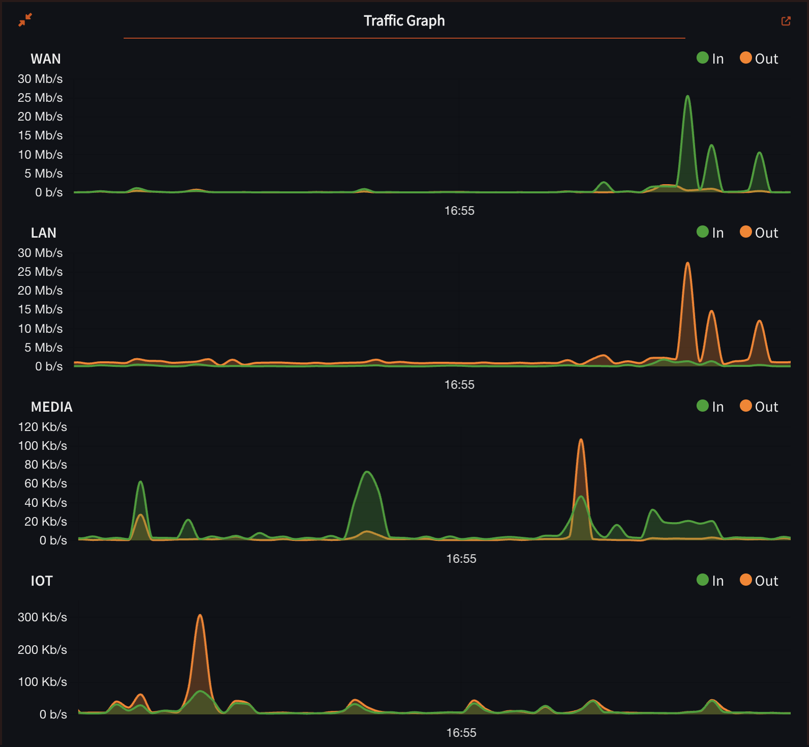
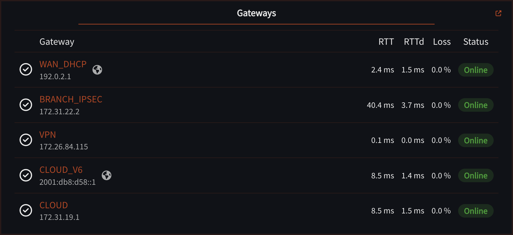
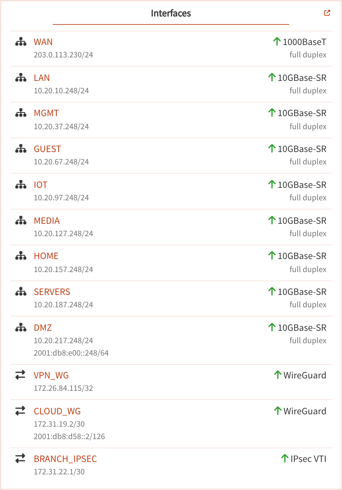
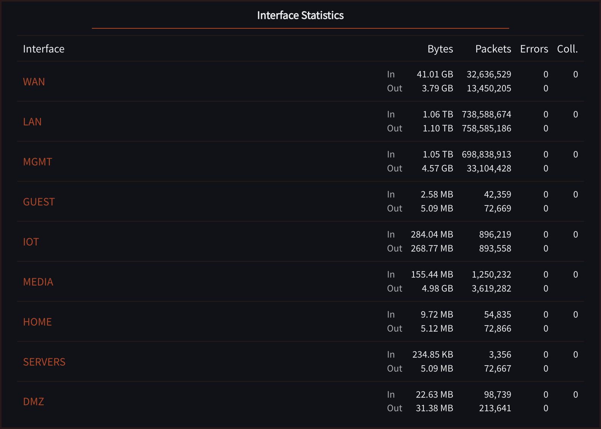
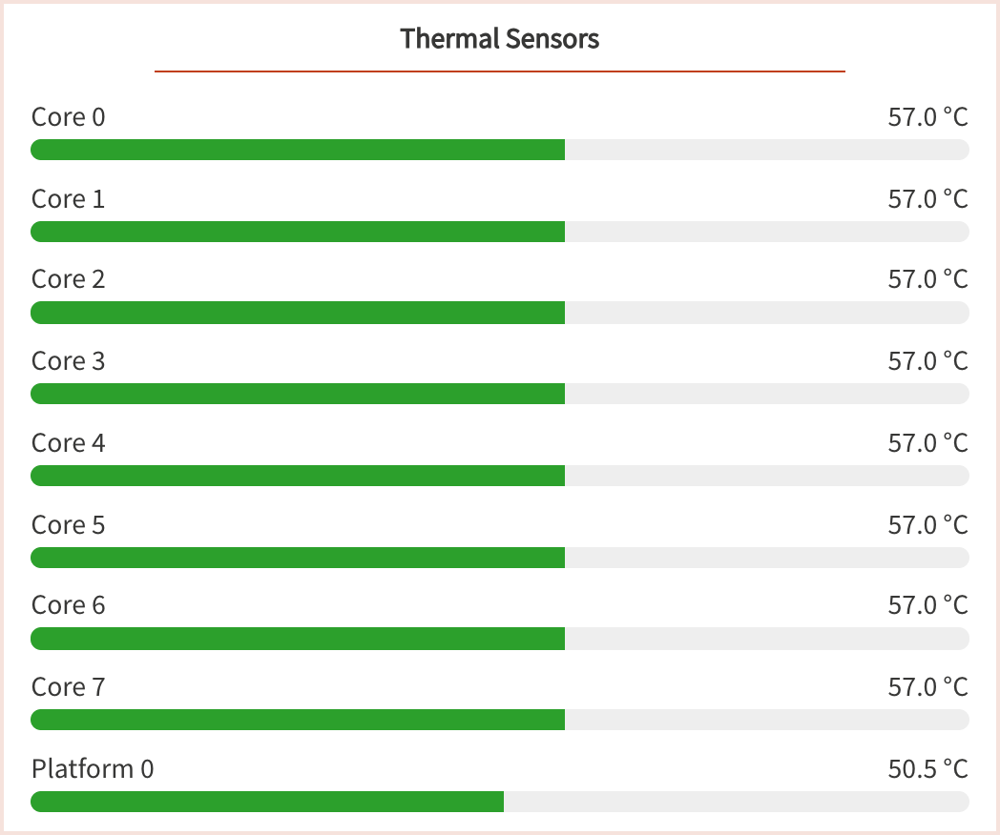
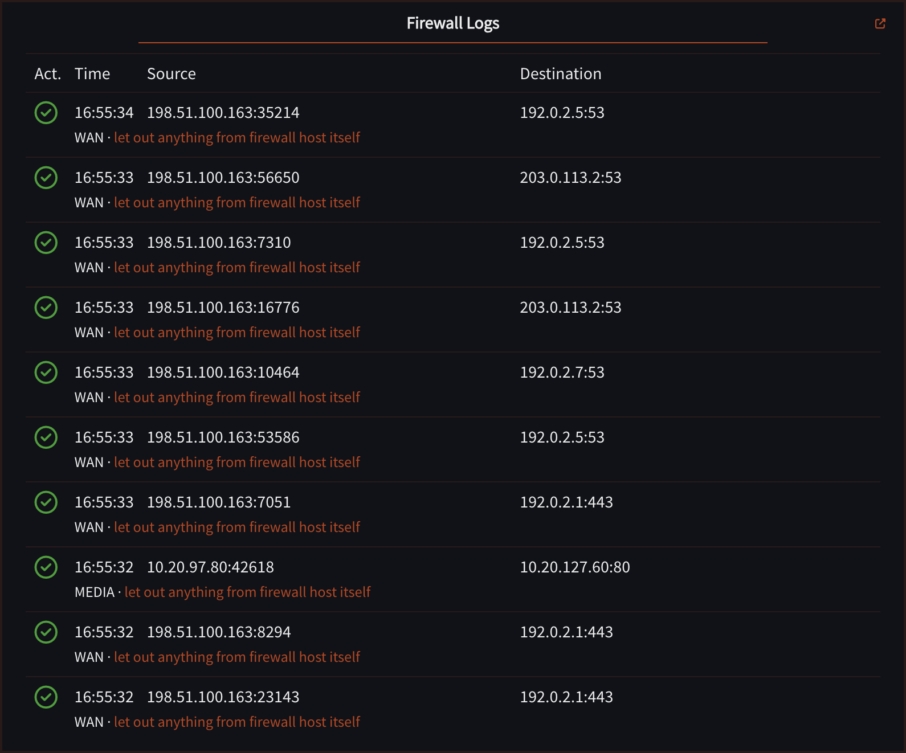

# Dashboard Plus for OPNsense

Two community plugins for [OPNsense](https://opnsense.org) 26.7, published as signed packages:

| Package | What it adds |
|---|---|
| **os-dashboard-plus** | Enhanced dashboard widgets: System Information+, Traffic Graph+, System Metrics+, Thermal Sensors+, Interface Statistics+, Gateways+, Interfaces+ and Firewall Logs+. |
| **os-firewall-map** (Firewall Map+) | The firewall's live traffic (IPv4 and IPv6) on a world map, as a dashboard widget and a full-size page, with plain-language details, threat lists, Suricata alerts and a Threats panel. |

These are not official OPNsense plugins. They do not modify the OPNsense core.

## Install

As `root` on the OPNsense console or over SSH:

```sh
fetch -qo - https://raw.githubusercontent.com/claudioguareschi/opnsense-dashboard-plus/packages/install.sh | sh
```

This adds the package repository (`/usr/local/etc/pkg/repos/dashboard-plus.conf`) and its public
signing key. Then install from **System ▸ Firmware ▸ Plugins** (`os-dashboard-plus`,
`os-firewall-map`), or with `pkg install os-firewall-map`. Updates arrive with normal firmware
updates. The repository contains only these two packages.

To remove it: uninstall the plugins, then delete `/usr/local/etc/pkg/repos/dashboard-plus.conf`
and `/usr/local/etc/pkg/keys/dashboard-plus-repository.pub`.

## Firewall Map+

The firewall's live traffic on a world map: a dashboard widget, and a full-size page opened with
the expand link on the widget (`/ui/firewallmap`).



*The full-size page. The map (left) draws an arc from the firewall (the house) to every remote
address it is talking to, coloured by who opened the connection: green from inside, orange from
outside. Red dots are sources the firewall blocked. The filters above the map narrow it by traffic
type, service, interface, inside host and country; **Threats** opens the review list. On the
right, **Top talkers** ranks hosts (or countries and networks) with a live sparkline, and the
details panel below explains whatever you click: here an arc to Ashburn, showing the inside host
that opened it, the service (HTTPS), the remote network, the firewall's decision and rule,
transfer totals and rates, with Investigate, States and Kill states actions.*



*The dashboard widget: the same live map in compact form, with a one-line summary of active flows
and blocked sources. The link in the corner opens the full-size page; its settings dialog holds
the display options and, for administrators, the firewall-wide settings described below.*

### What you see

- **Live connections**: an arc from the firewall to every remote address, from PF state counters
  sampled every 2 seconds. **Green** arcs were opened from inside your network, **orange** from
  outside (port forwards, services on the firewall), grey from both. Pulses travel in the
  direction the data flows. Arcs fade in and out and keep their curve while they live.
- **Blocked attempts**: connection attempts the firewall dropped (from the filter log) pulse in
  red towards the firewall, above a configurable number of hits.
- **Threats in crimson**: traffic to or from an address in a threat list, the AbuseIPDB blacklist,
  a cached AbuseIPDB verdict of 75% or more, your watchlist, or a Suricata alert of severity 1-2.
- **Suricata alerts**: when the Intrusion Detection service runs, its alerts are read locally and
  shown on the address they concern; addresses that alerted without an open connection get a
  hollow marker.

### Plain-language details

Hover or click an arc or an endpoint. Each card starts with the verdict (*Allowed*, *Allowed:
flagged traffic got through*, or *Blocked*), then one sentence per address, for example:

> *This firewall queried DNS (53/udp) at arin.authdns.ripe.net (RIPE NCC, The Netherlands).*
> *94.154.43.203 (Storm Industries LLC, The Netherlands) reached mail (192.168.1.2) on HTTP (80/tcp) through a port forward.*
> *103.155.198.103 (PT Lintas Jaringan Nusantara, Indonesia) tried SSH (22/tcp) and Telnet (23/tcp) on this firewall: blocked 12× in the last 10 min by "Default deny" on WAN.*
> *⚑ Suricata: ET SCAN Potential SSH Scan (severity 2, Attempted Information Leak), 1× in the last 1 h*

### Full-size page

- **Filters**: traffic (all, permitted, blocked, threats that got through, IDS alerts), service,
  interface, inside host, country and network (click an ASN).
- **Colour** by who connected (default), data direction, egress interface or service, with a
  legend.
- **Top talkers** by host, country and network with sparklines; click one to filter the map.
- **Resizable panels**: drag the handles between the map and the side panel, and between the top
  talkers and the details (double-click resets).
- **Actions** (administrators): *Investigate* (registry via RDAP, routing via RIPEstat and, with a
  key, AbuseIPDB reputation), Whois, AbuseIPDB page, show or kill the address's states, add it to
  an alias, add its country to a GeoIP alias, and *Mark as threat* (adds it to the
  `FWMAP_Watchlist` host alias).

### Threats (administrators)

**Threats** on the full-size page lists traffic to or from flagged addresses, sorted into tabs by
what actually happened. **Passed / reached host** (the default) holds what got through: a PF state
shows the firewall allowed it, so this is what to look at. **Blocked by firewall** (from the filter
log) and **Dropped by IPS** (Suricata drops) are kept as evidence without piling up as work.
**All**, **Reviewed** and **Dismissed** complete the set.

Each entry shows every threat list the address is on, who it belongs to and where, what it
reached and from which inside host, services, first and last seen, volume and Suricata
signatures. You can investigate, add a note, mark it reviewed or dismissed, and *Block…* adds the
address (IPv4 or IPv6) to an alias you choose; it blocks only if a firewall rule uses that alias.
When history is full, blocked and dropped entries are removed before passed ones. Entries are kept
for 90 days.

While the widget is on a dashboard, threat history keeps being fed in the background (a light
sample every 20 seconds) even with no map open; switch this off in the Threats footer.

### Threat lists

Threat lists only **mark** traffic; no firewall rule is added or changed unless you use an alias in
a rule yourself. Choose them in the widget settings (administrators):

- Curated feeds, downloaded daily by Firewall Map+: Spamhaus DROP, abuse.ch Feodo Tracker,
  Emerging Threats compromised hosts, FireHOL level 1.
- Any URL-table or external alias of your own (e.g. CrowdSec).
- With an AbuseIPDB API key: the AbuseIPDB blacklist (up to 10,000 IPv4 and IPv6 addresses at
  100% confidence, one download a day) and the verdicts of your *Investigate* lookups (flagged at
  75% or more; a separate cache).
- `FWMAP_Watchlist`, filled by *Mark as threat*.

**Maintain blocklist aliases** (widget settings) keeps a `FWMAP_*` alias for each selected curated
feed (a daily URL table) and, with a key, `FWMAP_AbuseIPDB` (filled from the downloaded blacklist,
IPv4 and IPv6, after each download and at boot). Firewall Map+ adds no rules: use the aliases in
your own block rules, on the interfaces you choose. The map itself works from its own daily copy of
each selected feed, so the lists count for flagging with the switch off too. Turning it off, or
deselecting a feed, removes the aliases Firewall Map+ made, but only once no rule uses them; aliases
of your own are never touched. On upgrade the switch starts on where `FWMAP_*` feed aliases
already exist. Uninstalling leaves the aliases in place (rules may still refer to them).

### IPv6

Everything works for IPv4 and IPv6: PF states and the filter log, routed IPv6 prefixes behind the
firewall, threat lists (separate compact IPv4 and IPv6 indexes), AbuseIPDB, GeoIP and ASN lookups,
investigations, the Threats panel and *Block…*. An address with a port reads `[2001:db8::1]:443`.

### Suricata (Intrusion Detection)

No setup is needed in Firewall Map+: alerts from `/var/log/suricata/eve.json` appear as soon as
Suricata raises them. Suricata only matches most rules when one side is in its *Home networks*.
When it monitors the WAN interface it sees addresses before NAT, so add your WAN address(es) to
*Home networks* (Services ▸ Intrusion Detection ▸ Administration), or monitor the LAN interfaces
instead.

### Settings

Per-user display settings are in the widget's settings dialog: busiest-arc highlighting, maximum
arcs, city labels, blocked traffic and its minimum hits, hostname lookups and network (ASN) names.
Administrators also see the firewall-wide settings there: geolocation service (automatic, MaxMind
GeoLite2, MaxMind GeoIP2 City, DB-IP Lite), MaxMind license key (taken from a MaxMind GeoIP alias
when present), database update frequency, AbuseIPDB API key, threat lists and *Maintain blocklist
aliases*. Keys are write-only and never displayed or logged.

### What leaves the firewall

| When | Where | What is sent |
|---|---|---|
| Geolocation database update (every few days) | MaxMind or DB-IP | Your MaxMind key (MaxMind only). Lookups themselves are local. |
| Daily, with an AbuseIPDB key | AbuseIPDB | Your key, to download the blacklist. |
| Threat-list aliases (daily, OPNsense's alias updater) | The list provider | The download request only. |
| *Investigate* clicked | rdap.org, stat.ripe.net, AbuseIPDB | The one address being investigated. |
| *Lookup hostnames* enabled | Your DNS resolver | Reverse lookups of remote addresses. |

The collector runs while a map is open, or in the background while the widget is on a dashboard
and background recording is on. It uses a few percent of one CPU core while a map is open.

## Dashboard Plus

Eight widgets that sit next to OPNsense's built-in ones in **Add widget**. Everything is read
locally from the firewall's own API. Each widget's options are in its settings dialog (gear icon
on the widget).

### System Information+



*Name and GUI user; hardware (manufacturer, model, serial number); firmware (vendor, version,
release date, boot method) and the current and next boot environment; OPNsense and FreeBSD
versions with update status; CPU model, current and maximum frequency and core/thread layout;
crypto hardware (AES-NI, QuickAssist) and the algorithms accelerated for IPsec; kernel PTI and MDS
mitigation state; uptime, date and time; and the DNS resolver the firewall itself uses. No
settings.*

### System Metrics+



*CPU usage and temperature as live charts, with the load averages; gauges for memory, firewall
states (**Show** opens the state table), mbufs and swap, with the exact figures under each gauge;
and filesystem usage. Settings: which components to show, and the chart window (20 seconds,
1 minute or 5 minutes).*

### Traffic Graph+



*Live traffic in and out, one chart per interface or all interfaces combined, each interface in its
own colour. The icon in the top-left corner switches between the expanded view shown here and a
compact one. Settings: per-interface or combined display, which interfaces, and the time window
(20 seconds, 1 minute or 5 minutes).*

### Gateways+



*Every gateway with its address, RTT, RTT deviation, packet loss and a status badge (online,
warning, offline, unmonitored); the globe marks the default gateway. Rows can be dragged into any
order. Settings: which gateways and which metrics to show.*

### Interfaces+



*Link state, IPv4 and IPv6 addresses and media for the interfaces you choose, including IPsec VTI,
WireGuard and OpenVPN tunnels; rows can be dragged into any order. Settings: which interfaces.*

### Interface Statistics+



*Bytes, packets, errors and collisions in and out per interface; rows can be dragged into any
order. Settings: which interfaces, which fields, and the refresh interval (1, 5 or 10 seconds).*

### Thermal Sensors+



*The temperature sensors you choose, including per-core readings, as bars with the current value.
Settings: which sensors.*

### Firewall Logs+



*The live firewall log: action, time, source and destination with ports, the interface and the
rule that matched (click it to open the full firewall log filtered on that entry). Settings: which actions (pass, block or all), which
interfaces, and how many rows.*

The screenshots come from a test firewall; host names, addresses, interface names and location
were replaced with example values.

## Building from source

On an OPNsense machine of the target release (git is required):

```sh
git clone https://github.com/claudioguareschi/opnsense-dashboard-plus.git
cd opnsense-dashboard-plus
tools/build.sh                   # both plugins; packages in ./dist
DEVEL=1 tools/build.sh security/firewall-map   # a development package
pkg add -f dist/os-firewall-map-devel-*.pkg
```

The build and publishing scripts live in `tools/`; packages are built only from the plugin
folders, so `tools/` is never part of a package. `build.sh` fetches the [opnsense/plugins](https://github.com/opnsense/plugins) build framework
for the running release and builds each plugin in it unchanged, so the plugin folders can also be
copied into a fork of opnsense/plugins as they are.

Firewall Map+'s map renderer (`security/firewall-map/renderer`) is built separately with Vite; the
built bundle is committed. See `renderer/package.json`.

### Publishing (maintainer)

Both packages share one version (`PLUGIN_VERSION` in each Makefile, no revision) and are released
together: 0.50, 0.51, ... (pkg compares the parts as numbers, so 0.6 would sort below 0.50).
The signed feed lives in the `packages` branch, kept as a single commit. On the machine holding
the signing key:

```sh
tools/build.sh
tools/publish.sh /path/to/packages-branch-checkout
```

then commit and push that checkout, and tag the release commit on `main` as `v<version>`.
Every package of the feed must be in the folder when it is signed; `publish.sh` replaces older
versions and signs the whole catalogue.

## Changelog

- **0.50** (both packages): first beta. Dashboard Plus and Firewall Map+ now share one version
  number and are released together; the build and publishing scripts moved to `tools/`. No
  functional change since os-dashboard-plus 0.1_48 and os-firewall-map 0.1_79.

### Before 0.50

- **os-dashboard-plus 0.1_48**: System Metrics+ shows memory, states, mbufs and swap as one row of
  compact gauges (two rows when narrow) instead of three charts and a bar; hover a gauge for the
  exact numbers. CPU and temperature keep their charts.

- **os-firewall-map 0.1_79**: one switch, *Maintain blocklist aliases*, keeps the `FWMAP_*` alias of
  each selected feed and `FWMAP_AbuseIPDB` (on after upgrade where feed aliases exist); the map
  downloads the curated feeds itself, so they flag traffic with or without an alias; cleaner
  settings (no star, shorter help, checkboxes level with their labels).

- **os-firewall-map 0.1_78**: a Threats target on the firewall itself names its interface
  ("203.0.113.10 · WAN"); "+ N other targets" opens the card, which lists every target.

- **os-firewall-map 0.1_77**: a Threats card under *Passed* leads with the connection that got
  through, not a later blocked attempt; the *All* tab shows its count.

- **os-firewall-map 0.1_76**: IPv6 throughout (states, filter log, threat lists, AbuseIPDB,
  GeoIP, investigations, the UI); the review queue becomes **Threats**, with tabs by what happened
  (*Passed / reached host* first, then *Blocked by firewall*, *Dropped by IPS*); optional
  `FWMAP_AbuseIPDB` alias filled from the AbuseIPDB blacklist (no rule is added).

- **os-dashboard-plus 0.1_47**: QuickAssist endpoints of one model in the same state are one row
  with a count (e.g. "Intel QAT C62x ×3 (Active)"); the DNS row shows what the firewall resolves
  through: the local resolver (Unbound recursive or forwarding with its forwarders, Dnsmasq, BIND),
  else the resolv.conf servers, or "Not set".

- **os-dashboard-plus 0.1_46**: QuickAssist shows every started QAT device as active when qat_ocf
  is enabled (qat_ocf is one provider for all devices, not one per qatN); down, asym-only and
  user-mode-only devices show inactive.

- **os-firewall-map 0.1_6**: saved threat-list choices reload the live collector in place and
  appear in Reputation without waiting for its periodic refresh; compact, consistent spacing for
  checkbox rows in the widget Options dialog.
- **os-firewall-map 0.1_5**: a "Firewall Map+" item in System > High Availability > Settings,
  so the plugin settings (MaxMind and AbuseIPDB keys included) sync to the backup; the review
  queue, caches and downloaded databases stay local to each firewall.
- **os-firewall-map 0.1_4**: one outcome colour legend across badges and map (green allowed,
  grey blocked, amber flagged but stopped, red flagged and let through), "Follow traffic" (off by
  default; frames the live arcs with proportional padding and smooth fly-to, also a widget
  setting), IDS arcs fade out a minute after their connection closes, the firewall drawn as a
  house icon, zoom buttons that follow the theme and stay below the OPNsense menus, and no
  AbuseIPDB lookup offered for addresses already on the AbuseIPDB blacklist.
- **os-firewall-map 0.1_3**: Suricata alerts correlated with the exact connection (own arc with a
  detection marker, history rings, IDS flows vs IDS addresses), a uniform record per flagged
  connection (both sides, NAT and port-forward target, firewall decision and rule, Suricata action
  and DNS name) with a "Dropped by IPS" status, a redesigned full-size page (details cards, top
  talkers with search and an IDS tab, hover cards, one-row filters, zoom buttons), the review queue
  redesigned with connection snapshots, paging and bulk dismiss/delete, and AbuseIPDB checks in place.
- **os-firewall-map 0.1_2**: who opened each connection (green inside, orange outside), plain-language
  summaries with an allowed/blocked verdict, AbuseIPDB blacklist and verdicts, watchlist (*Mark as
  threat*), review queue, Suricata alerts, fading arcs, resizable panels, curated threat feeds
  chosen in the widget settings.
- **os-firewall-map 0.1_1**: first public release.
- **os-dashboard-plus 0.1_42**: updated package description (no functional change since 0.1_41).

## Licence

BSD 2-Clause, see [LICENSE](LICENSE). Firewall Map+ bundles deck.gl and luma.gl (MIT) and Natural
Earth data (public domain); DB-IP Lite data is CC BY 4.0; MaxMind GeoLite2 is subject to MaxMind's
EULA. See [THIRD_PARTY_NOTICES](security/firewall-map/THIRD_PARTY_NOTICES).
